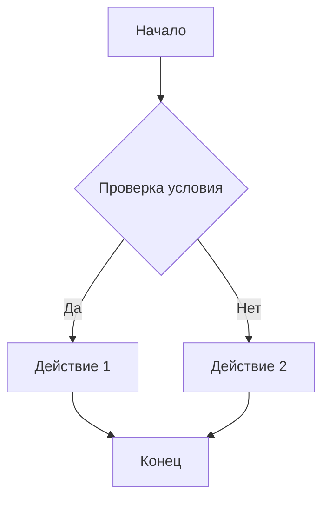

# Руководство по использованию Cursor IDE

## Оглавление
- [1. Введение в Cursor IDE](#1-введение-в-cursor-ide)
- [2. Установка и настройка](#2-установка-и-настройка)
  - [2.1. Скачивание и установка](#21-скачивание-и-установка)
  - [2.2. Необходимые плагины](#22-необходимые-плагины)
- [3. Регистрация и учетные записи](#3-регистрация-и-учетные-записи)
  - [3.1. Процесс регистрации](#31-процесс-регистрации)
  - [3.2. Типы подписок](#32-типы-подписок)
- [4. Основные функции Cursor IDE](#4-основные-функции-cursor-ide)
  - [4.1. Интерфейс и режимы работы](#41-интерфейс-и-режимы-работы)
  - [4.2. AI-возможности](#42-ai-возможности)
- [5. Настройка проекта для разработки](#5-настройка-проекта-для-разработки)
  - [5.1. Инициализация проекта](#51-инициализация-проекта)
  - [5.2. Специальные файлы Cursor](#52-специальные-файлы-cursor)
  - [5.3. Создание проекта](#53-создание-проекта)
  - [5.4. Стандартные инструменты разработки](#54-стандартные-инструменты-разработки)
  - [5.5. Форматы данных](#55-форматы-данных)
- [6. Работа с промтами](#6-работа-с-промтами)
  - [6.1. Формулирование эффективных промтов](#61-формулирование-эффективных-промтов)
  - [6.2. Примеры промтов](#62-примеры-промтов)
  - [6.3. Принципы генерации кода](#63-принципы-генерации-кода)
- [7. Разработка проекта](#7-разработка-проекта)
  - [7.1. Добавление функциональности](#71-добавление-функциональности)
  - [7.2. Тестирование](#72-тестирование)
  - [7.3. Рефакторинг](#73-рефакторинг)
  - [7.4. Управление версиями и откаты](#74-управление-версиями-и-откаты)
- [8. Лучшие практики использования Cursor](#8-лучшие-практики-использования-cursor)
- [9. Решение проблем](#9-решение-проблем)

## 1. Введение в Cursor IDE

Cursor IDE — это современная интегрированная среда разработки, расширяющая возможности VSCode с помощью встроенного ИИ-ассистента. Cursor предоставляет разработчикам мощные инструменты для ускорения процесса разработки, включая генерацию кода, автоматическое исправление ошибок, рефакторинг и многое другое.

## 2. Установка и настройка

### 2.1. Скачивание и установка

1. Перейдите на официальный сайт [Cursor](https://cursor.sh/)
2. Скачайте версию, соответствующую вашей операционной системе (Windows, macOS, Linux)
3. Запустите установщик и следуйте инструкциям по установке
4. После завершения установки запустите Cursor IDE

### 2.2. Необходимые плагины

В зависимости от стека технологий вашего проекта, рекомендуется установить следующие плагины:

- **Git** - для контроля версий
- **Flutter & Dart** - для разработки на Flutter
- **Java, Gradle** - для Java-разработки
- **TypeScript** - для TypeScript-проектов
- **ESLint/Prettier** - для форматирования кода
- **Node.js** - для JavaScript/TypeScript разработки
- **Python** - для Python-разработки

Установка плагинов выполняется через стандартный менеджер расширений, как в VSCode.

## 3. Регистрация и учетные записи

### 3.1. Процесс регистрации

1. При первом запуске Cursor предложит вам зарегистрироваться
2. Выберите опцию регистрации через Google-аккаунт
3. Предоставьте необходимые разрешения
4. После успешной авторизации вы можете начать использовать Cursor

### 3.2. Типы подписок

Cursor предлагает несколько вариантов подписки:

- **Free** - базовая подписка с ограниченным количеством AI-запросов и стандартной скоростью ответов
- **Pro** - расширенная подписка с большим количеством AI-запросов и дополнительными возможностями
- **Premium Requests** - различаются по скорости (Slow vs Fast)

Выбор подписки зависит от интенсивности использования и потребностей вашего проекта.

## 4. Основные функции Cursor IDE

### 4.1. Интерфейс и режимы работы

Cursor предлагает несколько режимов работы:

- **Режим редактора (Tab)** - стандартный режим для написания и редактирования кода
- **Чат (Chat)** - интерфейс для взаимодействия с AI-ассистентом
- **Композер (Composer)** - инструмент для генерации кода по описанию
- **Терминал** - встроенный терминал для выполнения команд
- **Поиск багов** - режим автоматического поиска и исправления ошибок в коде

### 4.2. AI-возможности

Основные AI-возможности Cursor:

- **Генерация кода** по текстовому описанию
- **Автозаполнение кода** с учетом контекста
- **Поиск и исправление ошибок**
- **Генерация коммитов** на основе внесенных изменений
- **Рефакторинг кода**
- **Документирование** существующего кода
- **Использование линтера** для автоматической проверки кода
- **Расширение контекста** (добавление файлов, папок или веб-ресурсов)
- **Ноутпады** для хранения заметок и идей

## 5. Настройка проекта для разработки

### 5.1. Инициализация проекта

Перед началом работы рекомендуется инициализировать Git-репозиторий:

```bash
git init
```

### 5.2. Специальные файлы Cursor

Для эффективной работы с Cursor рекомендуется создать следующие файлы:

- **.cursorrules** - файл с правилами для AI-ассистента
- **.cursorignore** - файл для исключения определенных директорий из анализа AI
- **.notes/project-overview.md** - файл с обзором проекта для контекста AI

Эти файлы помогут настроить взаимодействие с AI-ассистентом под специфику вашего проекта.

### 5.3. Создание проекта

При создании нового проекта рекомендуется использовать стандартные инструменты фреймворков или готовые шаблоны (boilerplate):

```bash
# Для React-проекта
npx create-react-app project-name

# Для Flutter-проекта
flutter create project-name --platforms=ios,linux,windows,macos,android

# Для JHipster-проекта
jhipster

# Для Node.js-проекта
npm init
```

Важно: **Всегда предпочитайте создание каркаса проекта специализированными утилитами** или используйте готовые boilerplate-решения, вместо того чтобы генерировать структуру с нуля через ИИ.

### 5.4. Стандартные инструменты разработки

В зависимости от типа проекта используйте следующие стандартные инструменты:

- **Git** - система контроля версий для отслеживания изменений и совместной работы
- **Flutter** - фреймворк для создания кроссплатформенных мобильных приложений
- **JHipster** - платформа для быстрой генерации веб-приложений
- **Node.js** - среда выполнения JavaScript для серверной разработки
- **Java/Python** - языки программирования для серверной разработки

### 5.5. Форматы данных

Рекомендуемые форматы данных для различных целей:

- **JSON** - для структурированных данных, конфигураций API и обмена данными
- **Markdown (MD)** - для форматированного текста, документации и инструкций
- **YAML (YML)** - для конфигурационных файлов, более читабельная альтернатива JSON
- **Mermaid в MD** - для создания диаграмм прямо в markdown-документах

Пример диаграммы Mermaid в Markdown:

```markdown


## 6. Работа с промтами

### 6.1. Формулирование эффективных промтов

Для эффективной работы с AI-ассистентом Cursor важно правильно формулировать запросы:

- Будьте конкретны в своих запросах
- Указывайте контекст (технологии, фреймворки)
- Разбивайте сложные задачи на более мелкие
- Указывайте ожидаемый формат результата

### 6.2. Примеры промтов

#### HTTP Клиент
```
В качестве транспорта используем авторизованный webview c post запросом и следующим телом...
```

#### Авторизация
```
Добавь SSO авторизацию, используя webview. Используй подход Model-Repository в качестве клиента, BLOC на событиях DelayedResult<T>. После авторизации webview должен скрываться.
```

#### Загрузка данных
```
На основе данного HTML создай модель данных и парсер, который извлечет данные о сотрудниках и их отпусках. Создай репозиторий отпусков с 3 вариантами загрузки: на сегодня, на завтра, на 1 год вперед.
```

#### Отображение данных
```
Добавь иконку в трее и меню со следующими пунктами:
- Отсутствуют сегодня
  - (список заявок)
- Отсутствуют завтра
  - (список заявок)
- Будут отсутствовать
  - (список заявок)
- (разделитель)
- Обновить данные
- (разделитель)
- Аутентификация/Выйти
- (разделитель)
- Выход
```

### 6.3. Принципы генерации кода

При работе с генерацией кода в Cursor следуйте следующим принципам:

- **Предпочитайте гарантированную генерацию генеративной**. Лучше использовать проверенные методы и инструменты, чем полагаться только на ИИ.
- **Поручайте ИИ скриптовать существующую генерацию**, а не генерировать всё самостоятельно. Многие профессиональные инструменты имеют скриптовые языки (макросы в Photoshop, Blender, MS Office) - попросите ИИ создать скрипт, который создаст то, что вам нужно.
- **Используйте AI для обработки и улучшения результатов**, а не для создания всего с нуля.

## 7. Разработка проекта

### 7.1. Добавление функциональности

При добавлении новых функций используйте возможности AI-ассистента:
- Описывайте задачу на естественном языке
- Используйте режим Composer для генерации кода
- Проверяйте и корректируйте сгенерированный код

### 7.2. Тестирование

Cursor может помочь с созданием тестов:
- Генерация модульных тестов
- Создание интеграционных тестов
- Тестирование пользовательского интерфейса

### 7.3. Рефакторинг

Для рефакторинга проекта с помощью Cursor:

1. Создайте пошаговый план рефакторинга, соответствующий принципам SOLID, DRY, KISS
2. Сохраните план в файле проекта
3. Индексируйте задачи рефакторинга
4. Решайте одну задачу за один раз
5. Делайте коммит после каждой задачи с сообщением в формате Conventional Commit
6. Отмечайте выполненные задачи в списке

Пример запроса для исправления ошибок сборки:
```
У нас все еще есть ошибки сборки, проверь их.
И помни:
Мы находимся в процессе большого рефакторинга согласно списку задач в /.notes/task_list.md, 
поддерживая /.notes/directory_structure.md.
```

### 7.4. Управление версиями и откаты

В процессе разработки важно правильно фиксировать результаты и уметь откатывать изменения при необходимости:

#### Git для управления версиями

```bash
# Фиксация изменений
git add .
git commit -m "feat: добавлена новая функциональность"

# Откат к предыдущему коммиту
git reset --hard HEAD~1

# Создание ветки для новой функциональности
git checkout -b feature/new-feature
```

#### Инструменты отката в Cursor

Cursor предоставляет несколько инструментов для управления версиями и откатов:

- **Restore checkpoint** - восстановление сохраненной контрольной точки
- **Cancel** - отмена последнего действия
- **Reapply** - повторное применение действия, которое не было корректно применено

Эти инструменты особенно полезны при работе с AI-ассистентом, когда сгенерированный код может не соответствовать вашим ожиданиям.

## 8. Лучшие практики использования Cursor

- Регулярно обновляйте IDE до последней версии
- Используйте специальные файлы (.cursorrules, .cursorignore) для более эффективной работы
- Храните описание проекта в .notes/project-overview.md
- Формулируйте четкие и конкретные запросы к AI-ассистенту
- Проверяйте сгенерированный код перед использованием
- Разбивайте сложные задачи на подзадачи
- Используйте Conventional Commits для коммитов
- Предпочитайте стандартные инструменты генерации кода вместо полной генерации через ИИ
- Для скриптовых задач запрашивайте у ИИ скрипты, а не готовые результаты
- Используйте современные форматы данных: JSON для данных, MD для текстов, YML для конфигов

## 9. Решение проблем

При возникновении проблем:
- Проверьте наличие ошибок в консоли
- Перезапустите Cursor
- Проверьте наличие конфликтующих плагинов
- Обновите Cursor до последней версии
- Используйте инструменты отката (Restore checkpoint, Cancel, Reapply)
- Обратитесь к документации или сообществу Cursor 